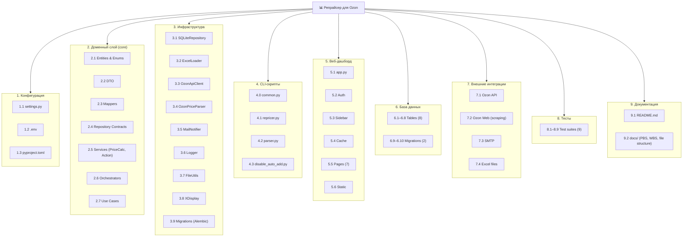

# PBS (Product Breakdown Structure) — `repricer-ozon`

PBS описывает **иерархию продукта** (подсистемы и модули), без привязки к задачам разработки.

## Иерархия

```
📊 Репрайсер для Ozon (продукт)
│
├── 1. Конфигурация
│   └── 1.1. Параметры окружения (config/settings.py) — API-ключи, SMTP, пути, коэффициенты
│   └── 1.2. .env-файлы — секреты и переменные окружения
│
├── 2. Доменный слой (core)
│   ├── 2.1. Сущности (entities.py) — ProductInfo, PricingData, StrategyInterval, PriceCalculationResult
│   ├── 2.2. DTO (dto.py) — ProductDTO, PriceUpdateRequestDTO, ProductViewModel
│   ├── 2.3. Мапперы (mappers.py) — преобразование entities ↔ DTO
│   ├── 2.4. Контракты (repository.py) — IProductRepository, ILoader
│   ├── 2.5. Бизнес-сервисы
│   │   ├── 2.5.1. PriceCalculationService — алгоритм расчёта цены (индексы, FBS-комиссии, стратегии)
│   │   ├── 2.5.2. MarginCalculator — расчёт маржинальности с учётом всех комиссий
│   │   ├── 2.5.3. ActionService — работа с акциями Ozon (получение/удаление автодобавления)
│   │   └── 2.5.4. calculate_old_price — расчёт old_price для Ozon
│   ├── 2.6. Оркестраторы
│   │   ├── 2.6.1. PriceUpdateCoordinator — оркестрация полного цикла репрайсинга
│   │   └── 2.6.2. PricingOrchestrator — устаревший, делегирует в PriceUpdateCoordinator
│   ├── 2.7. Use Cases
│   │   ├── 2.7.1. RepricingUseCase — вход в цикл репрайсинга
│   │   └── 2.7.2. DisableAutoAddUseCase — вход в операцию отключения автодобавления
│
├── 3. Инфраструктура (infrastructure)
│   ├── 3.1. SQLiteRepository — БД: товары, стратегии, история цен, маржи, агрегаты, очистка
│   ├── 3.2. ExcelLoader — чтение/запись Excel (товары, стратегии, обновление ячеек)
│   ├── 3.3. OzonApiClient — HTTP-клиент Ozon Seller API (product info, prices, actions)
│   ├── 3.4. OzonPriceParser — парсер цен конкурентов через undetected-chromedriver
│   ├── 3.5. MailNotifier — email-отчёты (plain + CSV-вложения)
│   ├── 3.6. Logger —.setRotation onstructlog + TimedRotatingFileHandler
│   ├── 3.7. FileUtils — блокировка/безопасное сохранение Excel
│   ├── 3.8. XDisplay — поиск доступного X-сервера для headless-браузера (Linux)
│   └── 3.9. Миграции (run_migrations_once) — запуск Alembic upgrade at startup
│
├── 4. CLI-скрипты (scripts)
│   ├── 4.1. repricer.py — запуск репрайсинга → Ozon API → расчёт → отправка цен → сохранение
│   ├── 4.2. parser.py — запуск парсера цен конкурентов → Chrome → запись в Excel
│   └── 4.3. disable_auto_add.py — отключение автодобавления в акции через Ozon API
│
├── 5. Веб-дашборд (ui / app.py)
│   ├── 5.1. app.py — точка входа Streamlit, роутинг по страницам
│   ├── 5.2. Auth — аутентификация пользователя
│   ├── 5.3. Sidebar — управление запусками, загрузка/скачивание Excel
│   ├── 5.4. Cache — кэширование данных в Streamlit (TTL 3600с)
│   ├── 5.5. Страницы
│   │   ├── 5.5.1. Сводка — KPI, динамика за 7 дней, топ-3/худшие-3
│   │   ├── 5.5.2. Статистика — распределение маржи, анализ стратегий, ROI
│   │   ├── 5.5.3. Аналитика — динамика цен, прогнозирование (полиномиальная регрессия), отклонения индексов
│   │   ├── 5.5.4. Анализ — комиссии FBS, индексы Ozon, ABC-анализ, диаграмма Парето
│   │   ├── 5.5.5. Таблицы — просмотр сырых таблиц БД
│   │   ├── 5.5.6. Запросы — управление товарами (история цен, удаление)
│   │   └── 5.5.7. Сервис — heatmap обновлений, очистка БД, диагностика, смена пароля
│   └── 5.6. Статика — styles.css, favicon
│
├── 6. База данных (SQLite + Alembic)
│   ├── 6.1. product — товары (product_id, sku, product_name, costs, strategies)
│   ├── 6.2. strategy — реальные стратегии
│   ├── 6.3. product_strategy — временные интервалы стратегий
│   ├── 6.4. product_price_history — история цен (все метрики каждого цикла)
│   ├── 6.5. product_marginality_history — история маржинальности (текущая/неделя/месяц)
│   ├── 6.6. product_price_daily — дневные агрегаты (avg/min/max)
│   ├── 6.7. price_calculation_logs — детальные JSON-логи расчётов
│   ├── 6.8. maintenance — служебные данные (last_cleanup)
│   ├── 6.9. migration 001 — initial schema
│   └── 6.10. migration 002 — daily aggregates + logs
│
├── 7. Внешние интеграции
│   ├── 7.1. Ozon Seller API — /v3/product/info/list, /v5/product/info/prices, /v1/product/import/prices, /v1/actions/*
│   ├── 7.2. Ozon Web (scraping) — парсинг страниц товаров конкурентов
│   ├── 7.3. SMTP — отправка email (Yandex, Gmail и т.д.)
│   └── 7.4. Excel (.xlsx) — источник данных и приёмник результатов
│
└── 8. Тесты
    ├── 8.1. test_api_client.py — тесты Ozon API
    ├── 8.2. test_database.py — тесты SQLiteRepository
    ├── 8.3. test_entities.py — тесты доменных сущностей
    ├── 8.4. test_integration.py — интеграционные тесты
    ├── 8.5. test_loader.py — тесты ExcelLoader
    ├── 8.6. test_ozon_parser.py — тесты парсера
    ├── 8.7. test_services.py — тесты PriceCalculationService
    ├── 8.8. test_update_competitor_prices.py — тесты обновления цен конкурентов
    └── 8.9. test_use_cases.py — тесты Use Cases
```

## Визуальная схема (Mermaid)


