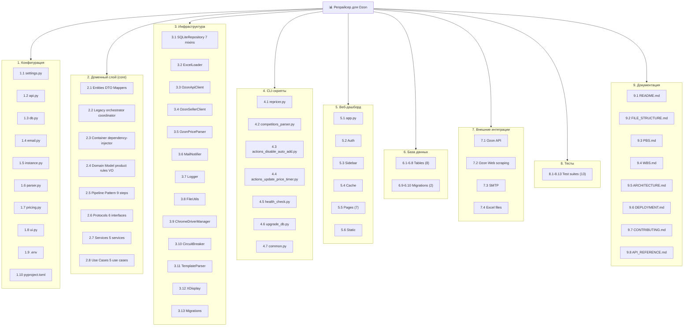

# PBS (Product Breakdown Structure) - repricer-ozon

PBS описывает иерархию продукта (подсистемы и модули), без привязки к задачам разработки.

## Иерархия

```
📊 Репрайсер для Ozon (продукт)
│
├── 1. Конфигурация
│   └── 1.1. Параметры окружения (config/settings.py) — API-ключи, SMTP, пути, коэффициенты
│   └── 1.2. API-настройки (config/api.py) — batch size, retries, timeout
│   └── 1.3. DB-настройки (config/db.py) — путь к БД, WAL mode
│   └── 1.4. Email-настройки (config/email.py) — SMTP конфигурация
│   └── 1.5. Instance-пути (config/instance.py) — data/logs пути
│   └── 1.6. Парсер-настройки (config/parser.py) — lock timeout, retries
│   └── 1.7. Ценообразование (config/pricing.py) — коэффициенты, стратегии
│   └── 1.8. UI-настройки (config/ui.py) — web user/pass
│   └── 1.9. .env-файлы — секреты и переменные окружения
│   └── 1.10. pyproject.toml — конфигурация проекта (ruff, mypy, pytest, deps)
│
├── 2. Доменный слой (core)
│   ├── 2.1. Сущности (entities.py) — ProductInfo, PricingData, StrategyInterval, PriceCalculationResult
│   ├── 2.2. DTO (dto.py) — ProductDTO, PriceUpdateRequestDTO, ProductViewModel
│   ├── 2.3. Мапперы (mappers.py) — преобразование entities <-> DTO
│   ├── 2.4. Legacy контракты (repository.py) — IProductRepository, ILoader
│   ├── 2.5. Legacy оркестраторы (orchestrator.py, price_coordinator.py) — устаревшие
│   ├── 2.6. DI-контейнер (container.py) — dependency-injector, singletons/factories
│   ├── 2.7. Enums (enums.py) — StrategyType (IntEnum), parse_strategy_value
│   ├── 2.8. Domain Model (domain/)
│   │   ├── 2.8.1. Product — агрегат товара с бизнес-логикой
│   │   ├── 2.8.2. PricingStrategy — Value Object стратегии
│   │   ├── 2.8.3. Value Objects — SKU, Money, Percentage, DiscountCoefficient, TimeInterval
│   │   └── 2.8.4. OzonPricingRules — все бизнес-правила Ozon
│   ├── 2.9. Pipeline Pattern (pipeline/)
│   │   ├── 2.9.1. PipelineOrchestrator — выполнение последовательности шагов
│   │   └── 2.9.2. Pipeline Steps (9 шагов) — LoadProducts, EnrichProductIds, FetchPricingData, CalculatePrices, PersistToExcel, SubmitPricesToOzon, SaveHistory, SendReport, CleanupDatabase
│   ├── 2.10. Protocol Interfaces (protocols/)
│   │   ├── 2.10.1. IApiClient — интерфейс Ozon API
│   │   ├── 2.10.2. ILoader — интерфейс загрузчика Excel
│   │   ├── 2.10.3. INotifier — интерфейс уведомлений
│   │   └── 2.10.4. Repository Protocols — 5 интерфейсов репозиториев
│   ├── 2.11. Бизнес-сервисы (services/)
│   │   ├── 2.11.1. PriceCalculationService — алгоритм расчёта цены (индексы, FBS-комиссии, стратегии)
│   │   ├── 2.11.2. ActionService — работа с акциями Ozon (получение/удаление автодобавления)
│   │   ├── 2.11.3. HistoryService — сохранение истории цен и дневных агрегатов
│   │   ├── 2.11.4. MigrationService — запуск Alembic миграций
│   │   └── 2.11.5. RealPriceSyncService — синхронизация реальных цен из шаблона Ozon
│   ├── 2.12. Use Cases (use_cases/)
│   │   ├── 2.12.1. RepricingUseCase — вход в цикл репрайсинга (через Pipeline)
│   │   ├── 2.12.2. DisableAutoAddUseCase — вход в операцию отключения автодобавления
│   │   ├── 2.12.3. ParseCompetitorPricesUseCase — парсинг цен конкурентов
│   │   ├── 2.12.4. BaseParserUseCase — базовый класс для парсеров
│   │   └── 2.12.5. UpdatePriceTimerUseCase — обновление таймера актуальности цены
│
├── 3. Инфраструктура (infrastructure)
│   ├── 3.1. SQLiteRepository (db/) — БД: товары, стратегии, история цен, маржи, агрегаты, очистка
│   │   ├── 3.1.1. connection.py — DBConnectionMixin (PRAGMA, WAL)
│   │   ├── 3.1.2. crud.py — CRUDMixin
│   │   ├── 3.1.3. strategies.py — StrategyMixin
│   │   ├── 3.1.4. history.py — HistoryMixin
│   │   ├── 3.1.5. marginality.py — MarginalityMixin
│   │   ├── 3.1.6. analytics.py — AnalyticsMixin
│   │   └── 3.1.7. maintenance.py — MaintenanceMixin
│   ├── 3.2. ExcelLoader — чтение/запись Excel (товары, стратегии, обновление ячеек)
│   ├── 3.3. OzonApiClient — HTTP-клиент Ozon Seller API (product info, prices, actions)
│   ├── 3.4. OzonSellerClient — Selenium для скачивания шаблона цен
│   ├── 3.5. OzonPriceParser — парсер цен конкурентов через undetected-chromedriver
│   ├── 3.6. MailNotifier — email-отчёты (plain + CSV-вложения)
│   ├── 3.7. Logger — structlog + TimedRotatingFileHandler
│   ├── 3.8. FileUtils — блокировка/безопасное сохранение Excel (pathlib)
│   ├── 3.9. ChromeDriverManager — undetected-chromedriver + fallback
│   ├── 3.10. CircuitBreaker — для API/парсера
│   ├── 3.11. TemplateParser — парсинг шаблона цен (zip XML + openpyxl fallback)
│   ├── 3.12. XDisplay — поиск доступного X-сервера для headless-браузера (Linux)
│   └── 3.13. Миграции (run_migrations_once) — запуск Alembic
│
├── 4. CLI-скрипты (scripts/)
│   ├── 4.1. repricer.py — основной репрайсинг (с синхронизацией ДО/ПОСЛЕ)
│   ├── 4.2. competitors_parser.py — парсинг цен конкурентов
│   ├── 4.3. actions_disable_auto_add.py — отключение автодобавления в акции
│   ├── 4.4. actions_update_price_timer.py — обновление таймера актуальности цены
│   ├── 4.5. health_check.py — проверка здоровья (диск, БД, Excel)
│   ├── 4.6. upgrade_db.py — ручной запуск миграций
│   └── 4.7. common.py — общие утилиты (сигналы, логирование)
│
├── 5. Веб-дашборд (ui/)
│   ├── 5.1. app.py — точка входа Streamlit, роутинг
│   ├── 5.2. Auth — аутентификация
│   ├── 5.3. Sidebar — запуск задач, загрузка/скачивание Excel
│   ├── 5.4. Cache — TTL кэширование + фабрики объектов
│   ├── 5.5. Pages (7 страниц)
│   │   ├── 5.5.1. Summary — Сводка (KPI, динамика 7 дней, топ-3/худшие-3)
│   │   ├── 5.5.2. Statistics — Статистика (распределение маржи, стратегии, ROI)
│   │   ├── 5.5.3. Analytics — Аналитика (динамика, прогноз, отклонения индексов)
│   │   ├── 5.5.4. Analysis — Анализ (комиссии FBS, индексы, ABC, Парето)
│   │   ├── 5.5.5. Tables — Просмотр сырых таблиц БД
│   │   ├── 5.5.6. Requests — Управление товарами (история, удаление)
│   │   └── 5.5.7. Service — Сервис (heatmap, БД, диагностика, пароль)
│   └── 5.6. Static — стили, favicon
│
├── 6. База данных (SQLite + Alembic)
│   ├── 6.1. product — товары (product_id, sku, product_name, rip, net_price, real_customer_price)
│   ├── 6.2. strategy — справочник стратегий (1: Ниже, 2: Выше, 3: Равная)
│   ├── 6.3. product_strategy — временные интервалы стратегий товара
│   ├── 6.4. product_price_history — полная история каждого цикла репрайсинга
│   ├── 6.5. product_marginality_history — маржинальность (текущая/неделя/месяц)
│   ├── 6.6. product_price_daily — дневные агрегаты (avg/min/max цены и маржи)
│   ├── 6.7. price_calculation_logs — детальные JSON-логи расчётов
│   ├── 6.8. maintenance — служебные данные (last_cleanup)
│   ├── 6.9. migration 001 — initial schema
│   └── 6.10. migration 002 — daily aggregates + logs
│
├── 7. Внешние интеграции
│   ├── 7.1. Ozon Seller API — /v3/product/info/list, /v5/product/info/prices, /v1/product/import/prices, /v1/actions/*
│   ├── 7.2. Ozon Web (scraping) — парсинг страниц товаров конкурентов
│   ├── 7.3. SMTP — отправка email (Yandex, Gmail и т.д.)
│   └── 7.4. Excel (.xlsx) — источник данных и приёмник результатов
│
├── 8. Тесты (tests/)
│   ├── 8.1. test_api_client.py — тесты Ozon API
│   ├── 8.2. test_database.py — тесты SQLiteRepository
│   ├── 8.3. test_entities.py — тесты доменных сущностей
│   ├── 8.4. test_integration.py — интеграционные тесты
│   ├── 8.5. test_excel_loader.py — тесты ExcelLoader
│   ├── 8.6. test_file_utils.py — тесты файловых утилит
│   ├── 8.7. test_loader.py — тесты загрузчика
│   ├── 8.8. test_mail_notifier.py — тесты MailNotifier
│   ├── 8.9. test_ozon_parser.py — тесты парсера
│   ├── 8.10. test_services.py — тесты PriceCalculationService
│   ├── 8.11. test_update_competitor_prices.py — тесты обновления цен конкурентов
│   ├── 8.12. test_update_price_timer.py — тесты обновления таймера
│   └── 8.13. test_use_cases.py — тесты Use Cases
│
└── 9. Документация
    ├── 9.1. README.md — основная документация
    ├── 9.2. docs/FILE_STRUCTURE.md — структура файлов
    ├── 9.3. docs/PBS.md — Product Breakdown Structure (этот файл)
    ├── 9.4. docs/WBS.md — Work Breakdown Structure
    ├── 9.5. docs/ARCHITECTURE.md — детальная архитектура
    └── 9.6. docs/DEPLOYMENT.md — развёртывание
```

## Визуальная схема (Mermaid)


