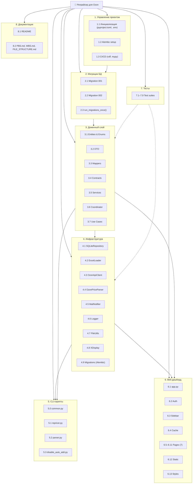
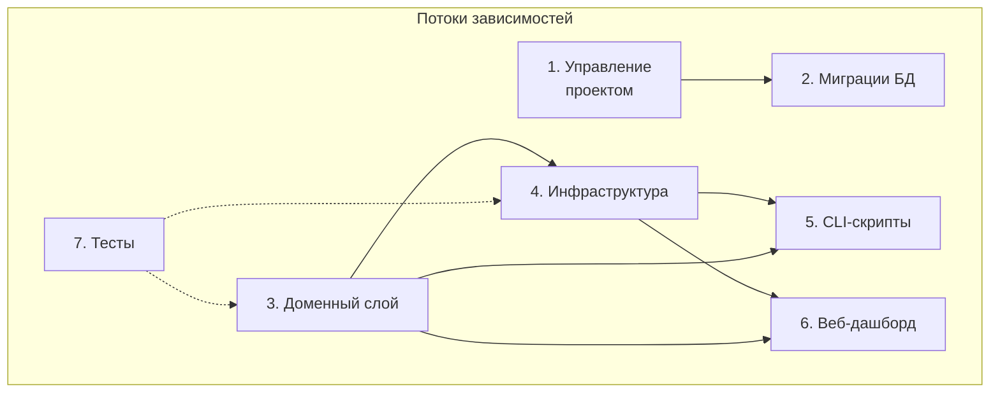

# WBS (Work Breakdown Structure) — `repricer-ozon`

WBS декомпозирует продукт на **пакеты работ** с конечными результатами (deliverables). Каждый пакет работ может быть оценён и назначен.

## Иерархия

```
🎯 Репрайсер для Ozon (продуктный пакет)
│
├── 1. Управление проектом и инфраструктура
│   ├── 1.1. Инициализация репозитория, структуры проекта, зависимостей
│   │   ├─ deliverable: requirements.txt, .env.example, .streamlit/config.toml
│   ├── 1.2. Настройка Alembic (alembic.ini, migrations/env.py, шаблоны)
│   │   ├─ deliverable: работающая env Alembic, базовая структура migrations/versions/
│   ├── 1.3. CI/CD: проверка тестов и линтеров (при наличии)
│   │   ├─ deliverable: pipeline.yml или аналогичный конфиг (плановое)
│
├── 2. Миграция базы данных (Alembic)
│   ├── 2.1. Migration 001 — initial schema
│   │   ├─ таблицы: product, strategy, product_strategy, product_price_history,
│   │   │  product_marginality_history, maintenance
│   │   ├─ индексы: idx_product_sku, idx_history_product_timestamp, idx_marginality_product_timestamp
│   │   ├─ seed-данные: strategy (Ниже/Выше/Равная), maintenance.last_cleanup
│   │   ├─ deliverable: 001_initial_schema.py
│   ├── 2.2. Migration 002 — daily aggregates + logs
│   │   ├─ таблицы: product_price_daily, price_calculation_logs
│   │   ├─ индексы: idx_history_timestamp, idx_history_product_marginality, idx_daily_product_date
│   │   ├─ deliverable: 002_add_daily_aggregates_and_logs.py
│   ├── 2.3. run_migrations_once() — единоразовый запуск миграций при старте
│   │   ├─ deliverable: функция в infrastructure/db.py, вызов во всех entry points
│
├── 3. Доменный слой (core)
│   ├── 3.1. Сущности (entities.py)
│   │   ├─ ProductInfo, StrategyInterval, PricingData, PriceCalculationResult, UpdateRequest
│   │   ├─ from_api_response() для PricingData (парсинг ответа Ozon API v5)
│   │   ├─ deliverable: core/entities.py
│   ├── 3.2. DTO (dto.py)
│   │   ├─ ProductDTO, StrategyIntervalDTO, PriceUpdateRequestDTO, ProductViewModel
│   │   ├─ deliverable: core/dto.py
│   ├── 3.3. Мапперы (mappers.py)
│   │   ├─ product ↔ DTO, build_price_update_request(), to_view_model()
│   │   ├─ deliverable: core/mappers.py
│   ├── 3.4. Контракты репозитория (repository.py)
│   │   ├─ IProductRepository (14 абстрактных методов)
│   │   ├─ ILoader (3 абстрактных метода)
│   │   ├─ deliverable: core/repository.py
│   ├── 3.5. PriceCalculationService
│   │   ├─ расчёт discount_coef на основе индексов external/ozon/self_marketplaces
│   │   ├─ расчёт target_min_price, strategy_price, result_target_price
│   │   ├─ выбор активной стратегии по времени (TIMEZONE-aware)
│   │   ├─ расчёт маржинальности с учётом всех комиссий FBS и FBO
│   │   ├─ формирование log_details (JSON)
│   │   ├─ calculate_old_price (округление до кратного)
│   │   ├─ deliverable: core/services/price_calculation.py
│   ├── 3.6. ActionService
│   │   ├─ get_all_auto_add_products() — пагинация по акциям
│   │   ├─ disable_auto_add_for_products() — батчи по 1000
│   │   ├─ deliverable: core/services/action_service.py
│   ├── 3.7. PriceUpdateCoordinator (orchestrator)
│   │   ├─ загрузка Excel → product_id/names → стратегии → цены/индексы → расчёт → отправка → сохранение
│   │   ├─ progress_callback для UI
│   │   ├─ формирование updates_for_ozon и excel_updates
│   │   ├─ _save_history с получением fresh real_price
│   │   ├─ auto_cleanup_if_needed
│   │   ├─ deliverable: core/price_coordinator.py
│   ├── 3.8. Use Cases
│   │   ├─ RepricingUseCase.execute(dry_run)
│   │   ├─ DisableAutoAddUseCase.execute(dry_run)
│   │   ├─ deliverable: core/use_cases/repricing.py, core/use_cases/disable_auto_add.py
│
├── 4. Инфраструктура (infrastructure)
│   ├── 4.1. SQLiteRepository
│   │   ├─ _get_connection с PRAGMA busy_timeout=30000 + WAL mode
│   │   ├─ CRUD: upsert_product, get_all_products, update_real_customer_price
│   │   ├─ стратегии: get_strategies, set_strategies
│   │   ├─ история: save_price_history, get_price_history, save_daily_aggregates
│   │   ├─ маржа: save_marginality, get_average_marginality
│   │   ├─ аналитика: get_kpi_metrics, get_strategy_roi, get_ozon_index_vs_price, get_commission_analysis
│   │   ├─ обслуживание: delete_old_records, delete_records_older_than, auto_cleanup_if_needed
│   │   ├─ прочее: get_all_last_prices, get_recent_history, get_top_bottom_marginality, get_update_heatmap, get_stale_products
│   │   ├─ deliverable: infrastructure/db.py
│   ├── 4.2. ExcelLoader
│   │   ├─ load() с валидацией SKU, себестоимости, дубликатов
│   │   ├─ чтение цен конкурентов (Цена 1..5)
│   │   ├─ парсинг интервалов и стратегий (4 интервала)
│   │   ├─ update_product_in_file (построчное обновление ячеек)
│   │   ├─ build_excel_updates (формирование payload)
│   │   ├─ deliverable: infrastructure/excel_loader.py
│   ├── 4.3. OzonApiClient
│   │   ├─ httpx.AsyncClient, retry (3 попытки, backoff)
│   │   ├─ get_product_ids_by_skus (/v3/product/info/list, батчи по 100)
│   │   ├─ get_product_prices (/v5/product/info/prices, батчи по 100)
│   │   ├─ update_prices (/v1/product/import/prices)
│   │   ├─ get_actions, get_auto_add_products, delete_auto_add_products
│   │   ├─ deliverable: infrastructure/ozon_api.py
│   ├── 4.4. OzonPriceParser
│   │   ├─ undetected-chromedriver, monkey-patch Patcher.fetch_release_number
│   │   ├─ _build_options (no-sandbox, headless, user-data-dir)
│   │   ├─ _init_driver с fallback на обычный Selenium
│   │   ├─ get_price (парсинг страницы, множественные CSS-селекторы цены)
│   │   ├─ restart (перезапуск драйвера)
│   │   ├─ deliverable: infrastructure/ozon_parser.py
│   ├── 4.5. MailNotifier
│   │   ├─ send_message (plain text)
│   │   ├─ send_message_with_attachment (CSV-вложение)
│   │   ├─ send_detailed_report (с детализацией или CSV при превышении лимита)
│   │   ├─ deliverable: infrastructure/mail_notifier.py
│   ├── 4.6. Logger
│   │   ├─ setup_logging (repricer, TimedRotatingFileHandler, backupCount=7)
│   │   ├─ setup_parser_logging (parser, изоляция логгеров selenium/UC/WDM)
│   │   ├─ structlog-конфигурация
│   │   ├─ deliverable: infrastructure/logger.py
│   ├── 4.7. FileUtils
│   │   ├─ wait_for_excel_available (проверка блокировки с таймаутом)
│   │   ├─ save_safely (tmp+replace, точечное обновление ячеек)
│   │   ├─ deliverable: infrastructure/file_utils.py
│   ├── 4.8. XDisplay
│   │   ├─ get_available_display (поиск сокетов, проверка через xdpyinfo/xauth)
│   │   ├─ deliverable: infrastructure/x_display.py
│
├── 5. CLI-скрипты (точки входа)
│   ├── 5.1. repricer.py
│   │   ├─ run_migrations_once → init repo/api/notifier/loader → RepricingUseCase → --dry-run
│   │   ├─ logging: repricer-{INSTANCE_NAME}.log
│   │   ├─ deliverable: scripts/repricer.py
│   ├── 5.2. parser.py
│   │   ├─ run_migrations_once → X-display → FileLock → iterate Excel по конкурентам
│   │   ├─ parse_price_with_retry (2 попытки, restart драйвера)
│   │   ├─ save_safely (точечное обновление цен конкурентов)
│   │   ├─ logging: parser-{INSTANCE_NAME}.log
│   │   ├─ deliverable: scripts/parser.py
│   ├── 5.3. disable_auto_add.py
│   │   ├─ run_migrations_once → OzonApiClient → DisableAutoAddUseCase → --dry-run
│   │   ├─ deliverable: scripts/disable_auto_add.py
│
├── 6. Веб-дашборд (Streamlit)
│   ├── 6.1. app.py
│   │   ├─ page_config, CSS, Font Awesome, аутентификация, роутинг по 7 страницам
│   │   ├─ deliverable: app.py
│   ├── 6.2. Auth
│   │   ├─ check_auth (сравнение с settings.WEB_USER / WEB_PASS)
│   │   ├─ deliverable: ui/auth.py
│   ├── 6.3. Sidebar
│   │   ├─ кнопки запуска репрайсинга/парсинга (execute_repricing, execute_parsing)
│   │   ├─ загрузка/скачивание Excel
│   │   ├─ FileLock для парсинга
│   │   ├─ deliverable: ui/sidebar.py
│   ├── 6.4. Cache
│   │   ├─ get_repo, get_cached_products, get_cached_kpi, get_cached_strategy_roi, get_cached_ozon_price_df, get_cached_last_prices
│   │   ├─ deliverable: ui/cache.py
│   ├── 6.5. Страница «Сводка»
│   │   ├─ 5 KPI метрик, графики за 7 дней (Plotly), топ-3 и худшие-3
│   │   ├─ deliverable: ui/pages/summary.py
│   ├── 6.6. Страница «Статистика»
│   │   ├─ распределение маржинальности (pie chart), стратегии (pie chart), ROI (bar chart)
│   │   ├─ deliverable: ui/pages/statistics.py
│   ├── 6.7. Страница «Аналитика»
│   │   ├─ вкладка «Динамика» — графики цен и маржи по товарам (multi-select)
│   │   ├─ вкладка «Прогнозирование» — полиномиальная регрессия (numpy.polyfit)
│   │   ├─ вкладка «Отклонения индексов» — отношение цены к индексу Ozon
│   │   ├─ deliverable: ui/pages/analytics.py
│   ├── 6.8. Страница «Анализ»
│   │   ├─ вкладка «Комиссии и индексы» — анализ комиссий FBS, scatter-графики
│   │   ├─ вкладка «ABC-анализ» — Парето-диаграмма, категории A/B/C
│   │   ├─ deliverable: ui/pages/analysis.py
│   ├── 6.9. Страница «Таблицы»
│   │   ├─ просмотр всех таблиц БД в Streamlit-dataframe
│   │   ├─ deliverable: ui/pages/tables.py
│   ├── 6.10. Страница «Запросы»
│   │   ├─ выбор товара, история цен, график динамики, удаление товара
│   │   ├─ deliverable: ui/pages/requests.py
│   ├── 6.11. Страница «Сервис»
│   │   ├─ heatmap обновлений (90 дней), последний запуск, очистка БД, скачивание БД, смена пароля, диагностика
│   │   ├─ deliverable: ui/pages/service.py
│   ├── 6.12. Статика
│   │   ├─ styles.css, favicon
│   │   ├─ deliverable: static/styles.css
│
└── 7. Тесты
    ├── 7.1. test_api_client.py — тесты OzonApiClient (pytest-httpx mocks)
    ├── 7.2. test_database.py — тесты SQLiteRepository
    ├── 7.3. test_entities.py — тесты сущностей и from_api_response
    ├── 7.4. test_integration.py — интеграционные тесты полного цикла
    ├── 7.5. test_loader.py — тесты ExcelLoader
    ├── 7.6. test_ozon_parser.py — тесты OzonPriceParser
    ├── 7.7. test_services.py — тесты PriceCalculationService
    ├── 7.8. test_update_competitor_prices.py — тесты парсинга цен конкурентов
    ├── 7.9. test_use_cases.py — тесты Use Cases
    ├─ deliverable: tests/test_*.py (9 файлов)
```

## Диаграмма (Mermaid)



## Связь между разделами (потоки зависимостей)


